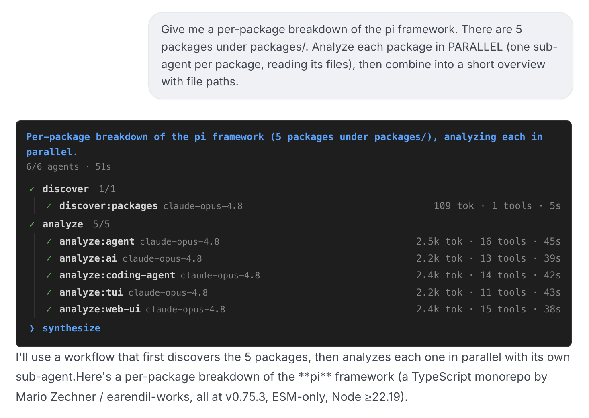
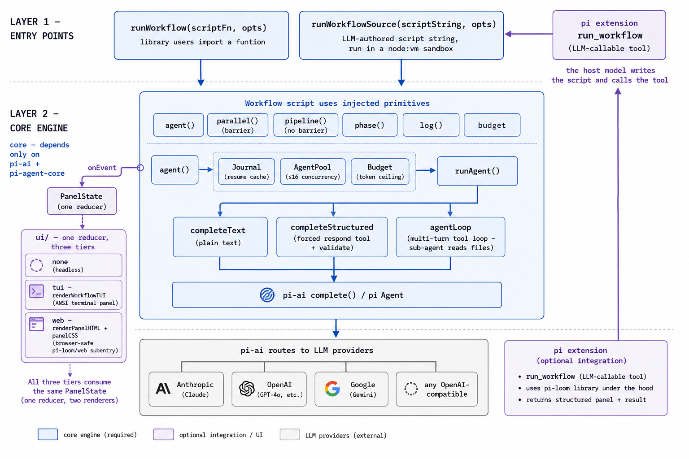

<p align="center">
  
</p>

# pi-loom

Deterministic multi-agent **workflow orchestration** on top of the open-source
[`pi`](https://github.com/earendil-works/pi) agent harness — a faithful clone
of Claude Code's dynamic-workflow primitives (`agent` / `parallel` / `pipeline`
/ `phase` / `log` / `budget`) with schema-forced structured output, adversarial
verification, and resumable journaling.

Here's what it looks like in practice — one real run inside a pi-based host. The
model turned the plain-language request at the top into a workflow, fanned out one
sub-agent per package, and pi-loom rendered the whole plan live as it ran: every
phase listed, the current one highlighted, sub-agents checking off as they finish.



You write the **plan as code**: a script holds the loop, the branching, and the
intermediate results, and each step is an LLM agent. The model does the thinking;
your code decides what runs next. Only the **final answer** reaches the main
context — the dozens of intermediate agent results stay in script variables — so
the orchestration is reproducible and scales to hundreds of subagents without
flooding a context window.

> New to dynamic workflows? Start with the deep-dive that explains the idea and
> the design behind pi-loom — **Scheduling Models with Model-Written Scripts**
> ([blog](https://betahi.github.io/posts/dynamic-workflows-and-pi-loom-en/) ·
> [Medium](https://medium.com/@laymanlzw/scheduling-models-with-model-written-scripts-a-deep-dive-into-claude-code-dynamic-workflows-75c94513a833)).

---

## Why this exists

Most agent frameworks make the **model** the orchestrator: it decides turn by
turn what to do next, and every intermediate result lands back in its context
window. That's powerful but non-reproducible and hard to scale past a handful of
steps.

Claude Code introduced a different shape — a **dynamic workflow**: a script that
orchestrates dozens to hundreds of subagents, where the *control flow* lives in
code and only the *final answer* reaches the main context. This project ports
that shape onto `pi`, an open-source, multi-provider agent harness — so you can
run the same orchestration against Anthropic, OpenAI, Google, or any
OpenAI-compatible endpoint, with no Claude Code runtime required.

---

## Design philosophy

| Principle | What it means here |
| :--- | :--- |
| **Code owns the plan** | Loops, branches, fan-out, and stopping conditions are plain TypeScript. The model never decides "what runs next" — your script does. |
| **The model owns the thinking** | Each `agent()` call is one focused LLM task. Reading, judging, extracting — the messy intelligence work. |
| **Structured output is the contract** | `agent(prompt, { schema })` forces a validated object back, so every downstream `filter`/`dedup`/`count` is deterministic code, not string parsing. |
| **Quality through adversarial structure** | The primitives compose into repeatable quality patterns — adversarial verify, judge panels, loop-until-dry — so a result is cross-checked, not single-pass. |
| **Deterministic & resumable** | Same script + same args ⇒ same agent-call sequence. A journal caches each result; re-running resumes from the longest unchanged prefix. |
| **Build on `pi`, add only orchestration** | `pi` already provides the hard parts — TypeBox schemas, token/cost accounting, context serialization. This library is a thin, well-tested orchestration layer on top. |

### The primitives

| Primitive | Semantics |
| :--- | :--- |
| `agent(prompt, opts?)` | Run one subagent. With `schema` → returns a validated object; without → returns text. Returns `null` after retries fail (callers `.filter(Boolean)`). |
| `parallel(thunks)` | Run concurrently, **barrier** (awaits all). A throwing thunk → `null`. Use when you need every result together (dedup, vote-count). |
| `pipeline(items, ...stages)` | Each item flows through all stages independently — **no barrier between stages**. Wall-clock = slowest single-item chain, not sum-of-slowest-per-stage. |
| `phase(title)` / `log(msg)` | Progress grouping + messages, surfaced via the `onEvent` callback. |
| `budget` | `total` / `spent()` / `remaining()`. `agent()` throws once the output-token budget is exhausted. |

---

## Architecture



---

## Use it from pi — an LLM-callable tool

The engine ships a [pi](https://github.com/earendil-works/pi) extension
([`extensions/`](extensions/)) that registers ONE tool, `run_workflow`. When
a pi user asks for something big in plain language, **pi's own model decides to
call it** and writes the orchestration script itself — exactly the "Claude writes
the script for the task" shape, ported to pi.

```bash
pi -e ./extensions/workflow.ts
> Run a workflow to audit every API route under src/ for missing auth checks.
```

pi's model authors a script (`phase` + `parallel` + `agent(...)`), `run_workflow`
executes it with pi's file tools wired into the sub-agents (so they can read the
repo), and returns the result. No extra config — sub-agents run on the host's
model and inherit its credentials (pi resolves the provider key from the
environment), so they authenticate exactly like the host session.

> **Robustness note.** A tool-using sub-agent drives pi's multi-turn `Agent`,
> which finishes when the model emits `agent_end`. If the underlying LLM request
> stalls — e.g. the model writes an over-large request the provider rejects with a
> long retry-after delay — that turn can hang and stall the whole run. Two knobs
> bound this, both forwarded to the sub-agent: pass a timeout `AbortSignal` (host
> cancels the wait) and/or `maxRetryDelayMs` in `RunOptions` (caps how long a
> provider-requested retry delay is honored). Neither is a hard guarantee against
> every provider stall; they make the failure recoverable instead of indefinite.

Under the hood the tool uses **`runWorkflowSource(scriptString, opts)`** — the
same engine as `runWorkflow`, but taking a script *string* (what an LLM emits)
instead of an imported function. The string runs in a `node:vm` sandbox with
static determinism checks — for reproducibility and foot-gun guarding, not as a
hard security boundary (the script is the host's own model's output, running in a
process that already executes arbitrary agent code).

---

## Live progress panel — terminal & web

A run emits a unified event stream (`phase` / `agent_start` / `agent_end` / …) via
`onEvent`. The UI is just **three consumers of that one stream**, so a host picks a
tier by where it runs — the engine never decides:

| Tier | Host imports | For |
| :--- | :--- | :--- |
| **none** (default) | — | headless; don't subscribe |
| **tui** | `renderWorkflowTUI` | a TTY host (the `pi` CLI) — a live panel that degrades to plain console lines off a TTY |
| **web** | `createPanelReducer` + `renderPanelHTML` + `panelCSS` | any web host — ship `PanelState` over your transport, render the HTML in the browser |

All three render the **same** `PanelState` as one tree, mirroring Claude's
`/workflows` view: every phase listed up front (current highlighted, pending
greyed, done checked), with each phase's sub-agents nested beneath it — model
badge · tokens · tools · elapsed.

**The screenshot at the top of this README is the web tier**, live in a host app:
the model autonomously called `run_workflow`, fanned out one sub-agent per
package, and the panel rendered the whole plan as it ran — pinned above the
streamed answer. The terminal tier draws the identical tree as ANSI text:

```bash
npx tsx examples/with-tui.ts   # terminal tier — no key, fake model, real panel
```

**Generic by construction.** The whole panel — the tree, highlighting, check-off,
colors, HTML, and CSS — lives in pi-loom (`src/ui/`): a pure
[`reducer`](src/ui/reducer.ts) (events → `PanelState`) feeding two pure renderers,
[`render-ansi.ts`](src/ui/render-ansi.ts) and
[`render-html.ts`](src/ui/render-html.ts). A web host writes no panel markup — it
imports the browser-safe `pi-loom/web` subentry (so none of the Node-only engine
code reaches the bundle), ships `PanelState` over its own transport (SSE/WS), and
drops `renderPanelHTML(state)` into a DOM node each frame.

---

## Install

**As a pi extension (primary):**

```bash
pi install npm:pi-loom        # or from a local checkout: pi install /path/to/pi-loom
# then, in pi:  /reload
```

That registers the `run_workflow` tool. The host pi session already has a working
model connection and credentials — sub-agents run on the host's model and inherit
its key from the environment, and pi's file tools are wired in automatically.
Nothing else to configure.

**As a library (embed the engine yourself):**

```bash
npm install pi-loom @earendil-works/pi-ai
```

Requires Node ≥ 22.19, ESM. You supply the `model` (and key, the standard pi-ai
way) when you call `runWorkflow` / `runWorkflowSource`.

---

## Examples

[`examples/deep-research-demo.ts`](examples/deep-research-demo.ts) is a 5-phase
workflow — **Scope → Research (pipeline) → Verify (3-vote adversarial) →
Synthesize** — the shape of Claude's bundled `/deep-research`, run against a
deterministic fake model (no key, no network). It asserts the exact agent-call
count, which is the whole point of "deterministic": same script ⇒ same plan.

```bash
npx tsx examples/deep-research-demo.ts
# → agentCalls = 26, expected = 26 → ✓ MATCH   (1 scope + 3 investigate + 3 extract + 6 claims × 3 votes + 1 synth)
```

[`examples/with-tui.ts`](examples/with-tui.ts) draws the live terminal panel —
the same phase tree as the web screenshot above, rendered as ANSI text.

---

## Credits

Built on [`pi`](https://github.com/earendil-works/pi) by earendil-works. The
workflow primitive design mirrors Claude Code's dynamic-workflow tool. See
[`deep-research.workflow.js`](deep-research.workflow.js) for the observed
workflow script that informed this implementation.
